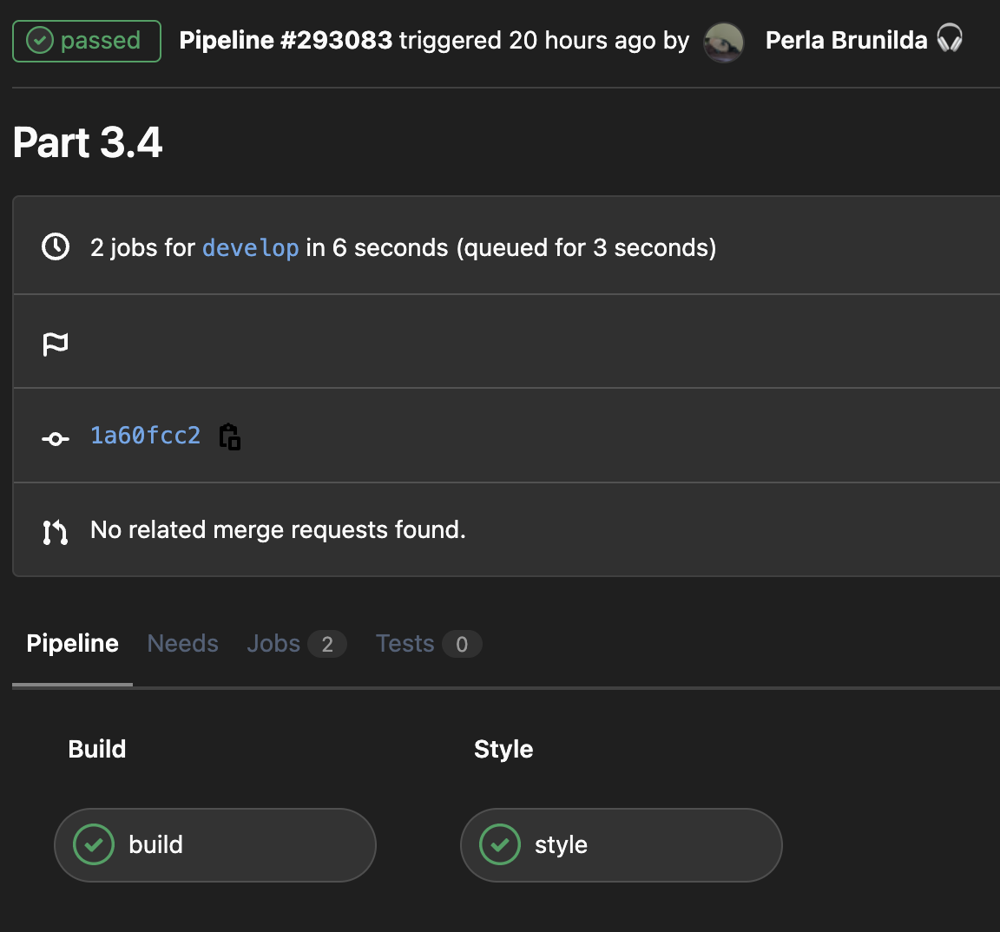
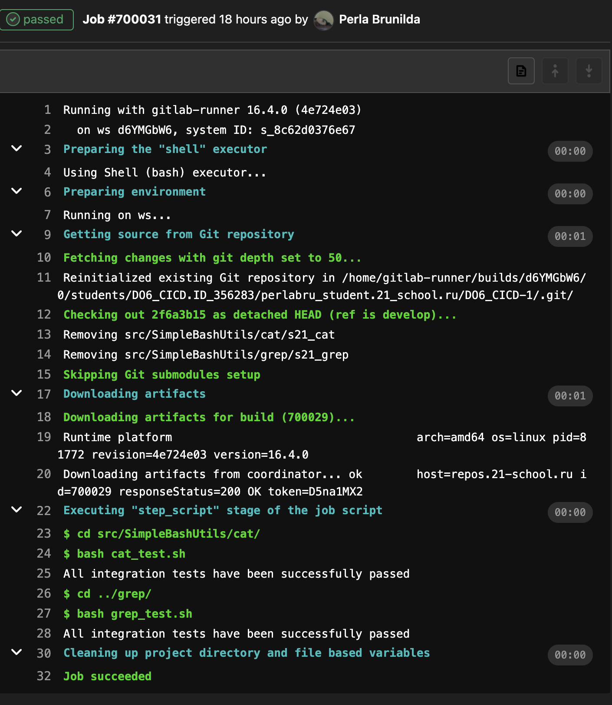
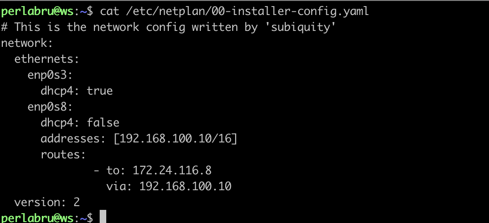
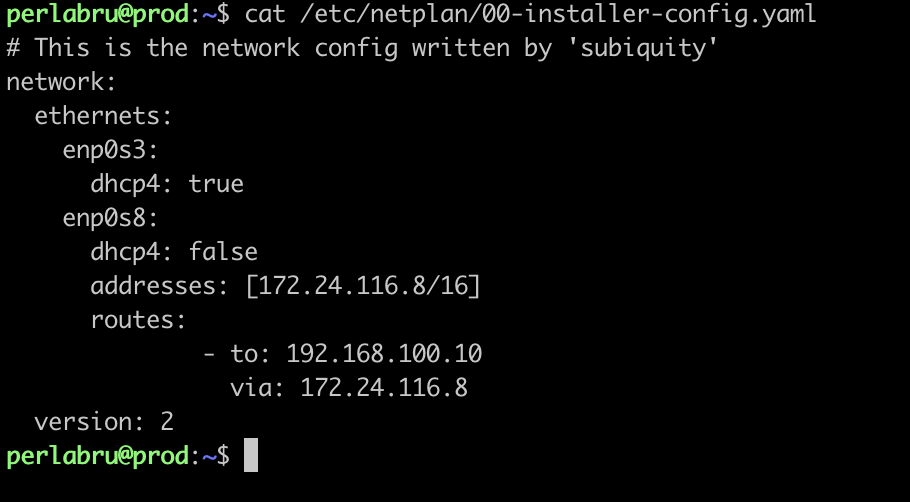
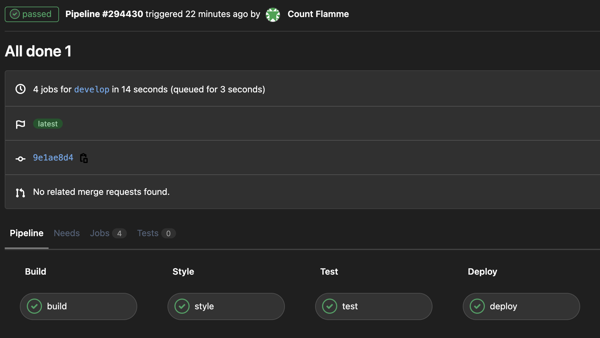
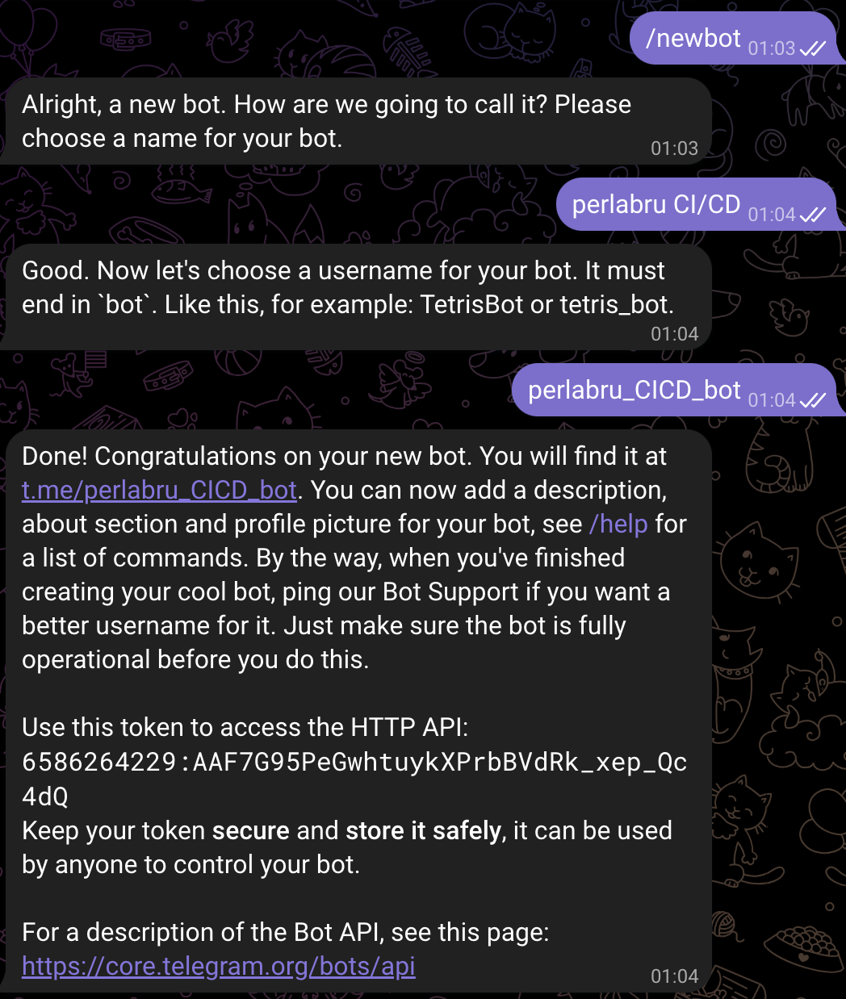
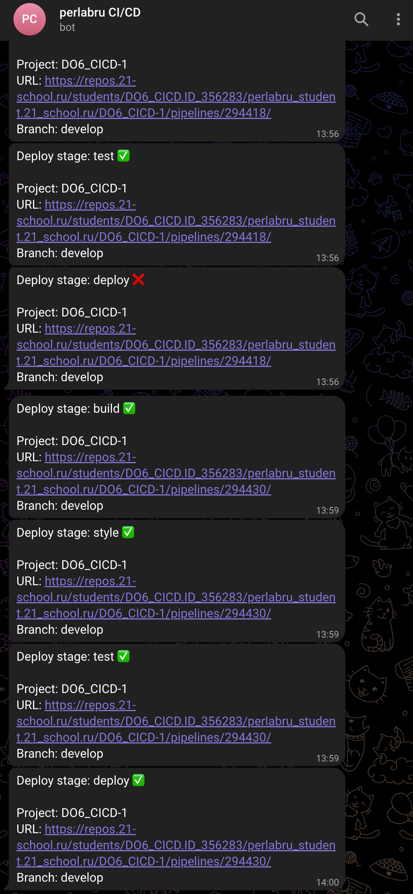

# **Basic CI/CD**

## **Содержание**

1. **[Настройка gitlab-runner](#part-1-настройка-gitlab-runner)**

2. **[Сборка](#part-2-сборка)**

3. **[Тест кодстайла](#part-3-тест-кодстайла)**

4. **[Интеграционные тесты](#part-4-интеграционные-тесты)**

5. **[Этап деплоя](#part-5-этап-деплоя)**


## **Part 1. Настройка gitlab-runner**

1. Добавить репозиторий GitLab: 
```shell
curl -L "https://packages.gitlab.com/install/repositories/runner/gitlab-runner/script.deb.sh" | sudo bash
```

2. Установим последнюю версию GitLab Runner:
```shell
sudo apt-get install -y gitlab-runner
```

3. [Регистрация](https://docs.gitlab.com/runner/register/) GitLab Runner для проекта
```shell
sudo gitlab-runner register
```
Введем URL-адрес `https://repos.21-school.ru`

Введём токен проекта ([получить можно со страницы задания проекта](https://edu.21-school.ru/project/26566/task)).

Также нужно ввести описание, теги и дополнительные примечания (если указываете тэги, то их также нужно прописать `.gitlab-ci.yml`).

После нужно выбрать исполнителя, в моем случае `shell`.

## **Part 2. Сборка**

Напишем этап для CI по сборке приложений из проекта C2_SimpleBashUtils. Для этого в файле `.gitlab-ci.yml` добавим этап запуска сборки через мейк файл из проекта C2. Все файлы, полученные после сборки (артефакты), сохранить в произвольную директорию со сроком хранения 30 дней.

---
*Итоговый файл .gitlab-ci.yml:*
```yml
stages:
  - build

build:
  stage: build
  script:
    - cd src/SimpleBashUtils/cat/
    - make
    - cd ../grep/
    - make
  artifacts:
    paths:
    - src/SimpleBashUtils/cat/s21_cat
    - src/SimpleBashUtils/grep/s21_grep
    expire_in: 30 days

```

**Подробная информация по .gitlab-ci.yml:**
- [Руководство по .gitlab-ci.yml](https://docs.gitlab.com/ee/ci/yaml/gitlab_ci_yaml.html)
- [Справочник по ключевым словам в .gitlab-ci.yml](https://docs.gitlab.com/ee/ci/yaml/index.html)
- [Руководство по работе с артефактами проекта](https://docs.gitlab.com/ee/ci/jobs/job_artifacts.html)

Для проверки нужно включить и запустить ранер.
```shell
sudo gitlab-runner start
sudo gitlab-runner run
```
На странице проекта в GitLab нужно зайти в раздел CI/CD и посмотреть статус pipeline.


## **Part 3. Тест кодстайла**

Теперь долним `.gitlab-ci.yml`и добавим в него новую стадию (`style`).
```yml
style:
  stage: style
  script:
    - clang-format -n -Werror src/SimpleBashUtils/cat/*.c src/SimpleBashUtils/cat/*.h src/SimpleBashUtils/grep/*.c src/SimpleBashUtils/grep/*.h
```

**Результат:**



## **Part 4. Интеграционные тесты**

Добавим ещё одну новую стадию `test`.
```yml
test:
  stage: test
  script:
    - cd src/SimpleBashUtils/cat/
    - bash cat_test.sh
    - cd ../grep/
    - bash grep_test.sh
```

**Результат:**



## **Part 5. Этап деплоя**

Необходимо поднять вторую машины и настроить соединение между ними.
```shell
vim /etc/netplan/00-installer-config.yaml
```





В этом пункте аналогично другим добавим новую стадию (`deploy`) и пропишем её.

```yml
deploy:
  stage: deploy
  script:
    - cd src/
    - chmod +x deploy.sh
    - bash deploy.sh
  when: manual
 ```

Также пропишем вызываемый скрипт `deploy.sh`.

```bash
#!/bin/bash

CAT_PATH=SimpleBashUtils/cat/s21_cat
GREP_PATH=SimpleBashUtils/grep/s21_grep
PROD_ADRS=perlabru@172.24.116.8
REMOTE_PATH=/usr/local/bin/

scp $CAT_PATH $GREP_PATH $PROD_ADRS:$REMOTE_PATH
ssh $PROD_ADRS ls $REMOTE_PATH
```

Обратите внимание, что scp может работать только через через sudo. Поэтому нужно добавить пользователя gitlab-runner в группу sudo. 
```shell
sudo usermod -aG sudo gitlab-runner
```

Теперь установим пароль для gitlab-runner, чтобы на него можно было переключиться.
```shell
sudo passwd gitlab-runner
```

Можно сменить пользователя.
```shell
su gitlab-runner
```

Осталось соеденить машины через ssh-ключ. Для этого генерируем ключ на первой машине и копируем его на вторую.
```shell
ssh-keygen
ssh-copy-id perlabru@172.24.116.8
```

*Может возникнуть ошибка прав доступа для ключа, поэтому на второй машине пропишем:*
```shell
chmod 600 ~/.ssh/authorized_keys
```

Теперь с первой машины через пользователя gitlab-runner можно подключаться ко второй без ввода пароля.

Осталось расширить права для нужной папки, чтобы мы могли туда записывать данные.
```shell
sudo chmod -R 777 /usr/local/bin/
```

**Проверим:**


## **Part 6. Дополнительно. Уведомления**

Чтобы создать бота, напишем @botfather в тг.



Для скрипта, который и будет отправлять сообщения, потребуется также получить ID-чата. Для этого можно написать боту @userinfobot

```bash
#!/bin/bash

BOT_TOKEN="6586264229:AAF7G95PeGwhtuykXPrbBVdRk_xep_Qc4dQ"
URL="https://api.telegram.org/bot$BOT_TOKEN/sendMessage"
ID="917956857"

if [[ $CI_JOB_STATUS = "success" ]]; then
    STATUS=✅
else
    STATUS=❌
fi

TEXT="Deploy stage: $1 $STATUS%0A%0AProject:+$CI_PROJECT_NAME%0AURL:+$CI_PROJECT_URL/pipelines/$CI_PIPELINE_ID/%0ABranch:+$CI_COMMIT_REF_SLUG"

curl -s -d "chat_id=$ID&disable_web_page_preview=1&text=$TEXT" $URL > /dev/null
```

Также обновим `.gitlab-ci.yml`, чтобы после каждой стадии нам приходило сообщение со статусом.

```yml
stages:
  - build
  - style
  - test
  - deploy

build:
  stage: build
  script:
    - cd src/SimpleBashUtils/cat/
    - make
    - cd ../grep/
    - make
  after_script:
    - bash src/bot.sh "build"
  artifacts:
    paths:
    - src/SimpleBashUtils/cat/s21_cat
    - src/SimpleBashUtils/grep/s21_grep
    expire_in: 30 days

style:
  stage: style
  script:
    - clang-format -n -Werror src/SimpleBashUtils/cat/*.c src/SimpleBashUtils/cat/*.h src/SimpleBashUtils/grep/*.c src/SimpleBashUtils/grep/*.h
  after_script:
    - bash src/bot.sh "style"

test:
  stage: test
  script:
    - cd src/SimpleBashUtils/cat/
    - bash cat_test.sh
    - cd ../grep/
    - bash grep_test.sh
  after_script:
    - bash src/bot.sh "test"

deploy:
  stage: deploy
  script:
    - cd src/
    - chmod +x deploy.sh
    - bash deploy.sh
  when: manual
  after_script:
    - bash src/bot.sh "deploy"
```

Проверим работу бота.


