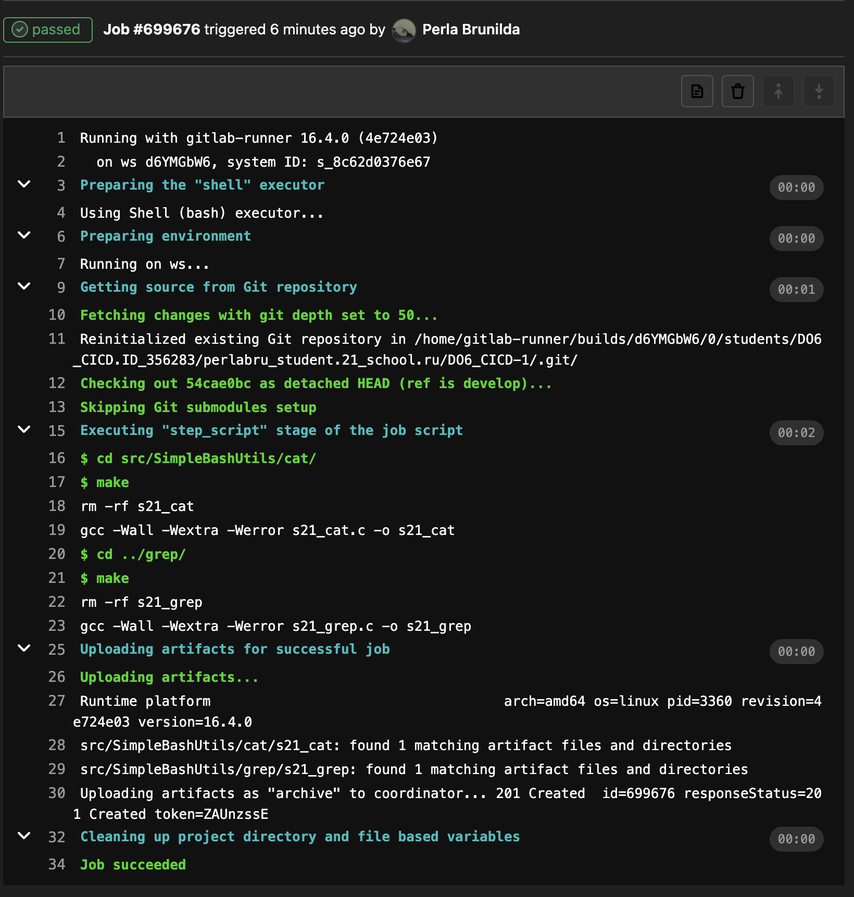

# **Basic CI/CD**

## **Содержание**

1. **[Настройка gitlab-runner](#part-1-настройка-gitlab-runner)**

2. **[Сборка](#part-2-сборка)**

3. **[Тест кодстайла](#part-3-тест-кодстайла)**


## **Part 1. Настройка gitlab-runner**

1. Добавить репозиторий GitLab: 
```shell
curl -L "https://packages.gitlab.com/install/repositories/runner/gitlab-runner/script.deb.sh" | sudo bash
```

2. Установим последнюю версию GitLab Runner:
```shell
sudo apt-get install -y gitlab-runner
```

3. [Регистрация](https://docs.gitlab.com/runner/register/) GitLab Runner для проекта
```shell
sudo gitlab-runner register
```
Введем URL-адрес `https://repos.21-school.ru`

Введём токен проекта ([получить можно со страницы задания проекта](https://edu.21-school.ru/project/26566/task)).

Также нужно ввести описание, теги и дополнительные примечания (если указываете тэги, то их также нужно прописать `.gitlab-ci.yml`).

После нужно выбрать исполнителя, в моем случае `shell`.

## **Part 2. Сборка**

Напишем этап для CI по сборке приложений из проекта C2_SimpleBashUtils. Для этого в файле `.gitlab-ci.yml` добавим этап запуска сборки через мейк файл из проекта C2. Все файлы, полученные после сборки (артефакты), сохранить в произвольную директорию со сроком хранения 30 дней.

---
*Итоговый файл .gitlab-ci.yml:*
```yml
stages:
  - build

build:
  stage: build
  script:
    - cd src/SimpleBashUtils/cat/
    - make
    - cd ../grep/
    - make
  artifacts:
    paths:
    - src/SimpleBashUtils/cat/s21_cat
    - src/SimpleBashUtils/grep/s21_grep
    expire_in: 30 days

```

**Подробная информация по .gitlab-ci.yml:**
- [Руководство по `.gitlab-ci.yml`](https://docs.gitlab.com/ee/ci/yaml/gitlab_ci_yaml.html)
- [Справочник по ключевым словам в `.gitlab-ci.yml`](https://docs.gitlab.com/ee/ci/yaml/index.html)
- [Руководство по работе с артефактами проекта](https://docs.gitlab.com/ee/ci/jobs/job_artifacts.html)

Для проверки нужно включить и запустить ранер.
```shell
sudo gitlab-runner start
sudo gitlab-runner run
```
На странице проекта в GitLab нужно зайти в раздел CI/CD и посмотреть статус pipeline.



## **Part 3. Тест кодстайла**