# UNIX/Linux operating systems (Basic).

## Installing and upgrading a Linux system. Administration basics.

## Contents

1. [Part 1. Installing the OS](#part-1-installing-the-os)

2. [Part 2. Creating a new user](#part-2-creating-a-new-user)

3. [Part 3. Setting up the OS network](#part-3-setting-up-the-os-network)

4. [Part 4. Updating the OS](#part-4-updating-the-os)

5. [Part 5. Using the sudo command](#part-5-using-the-sudo-command)

6. [Part 6. Installing and configuring the time service](#part-6-installing-and-configuring-the-time-service)

7. [Part 7. Installing and Using Text Editors](#part-7-installing-and-using-text-editors)

    7.1 [Vim](#vim)
    
    7.2 [Nano](#nano)

    7.3 [Joe](#joe)

8. [Part 8. Installing and basic configuration of the SSHD service](#part-8-installing-and-basic-configuration-of-the-sshd-service)

9. [Part 9. Installing and using the utilities top, htop](#part-9-installing-and-using-the-utilities-top-htop)

    9.1 [Top command output report from top](#top-command-output-report-from-top)

    9.2 [Screenshots of the htop command output](#screenshots-of-the-htop-command-output)

    9.3 [SORT BY PID](#sort-by-pid)

    9.4 [SORT BY PERCENT_CPU](#sort-by-percentcpu)

    9.5 [SORT BY PERCENT_MEM](#sort-by-percentmem)

    9.6 [SORT BY TIME](#sort-by-time)

    9.7 [FILTER 'sshd'](#filter-sshd)

    9.8 [SEARCH 'syslog'](#search-syslog)

    9.9 [Advanced hostname, clock and uptime output](#advanced-hostname-clock-and-uptime-output)

10. [Using the fdisk utility](#part-10-using-the-fdisk-utility)

11. [Using the df utility](#part-11-using-the-df-utility)

12. [Using the du utility](#part-12-using-the-du-utility)

13. [Installing and Using the ncdu Utility](#part-13-installing-and-using-the-ncdu-utility)

14. [Working with system logs](#part-14-working-with-system-logs)

15. [Using the CRON Job Scheduler](#part-15-using-the-cron-job-scheduler)

## Part 1. Installing the OS

You can check the installed version of Ubuntu by running the command:

```c
$ cat /etc/issue
```

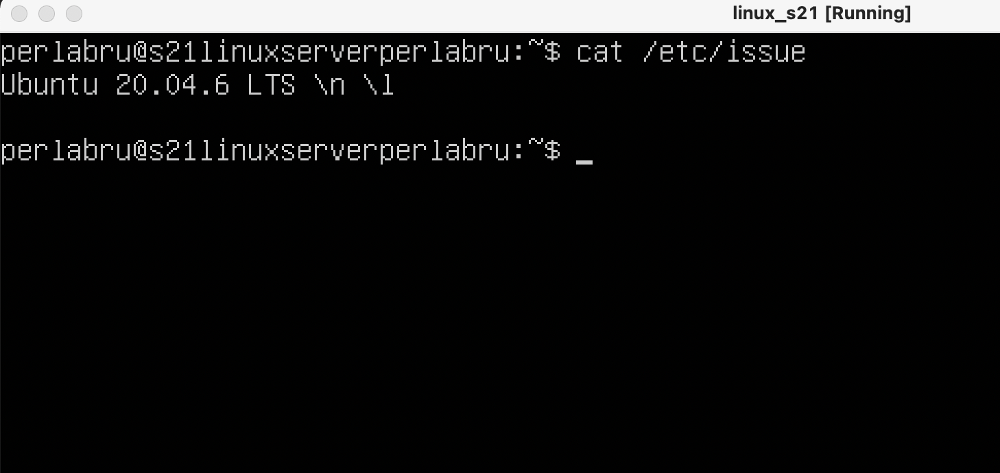

## Part 2. Creating a new user

To create a new user and add him to the adm group, follow these steps:

```c
$ sudo adduser <user_name>
$ sudo usermod -aG adm <user_name>
$ cat /etc/passwd | grep <user_name>
```

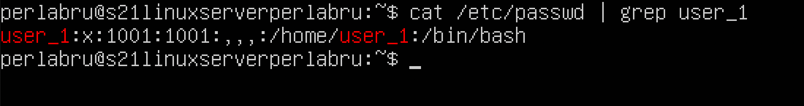

You can also check the list of user groups by using the command:

```c
$ groups <user_name>
```


## Part 3. Setting up the OS network

1. Set the new machine name as user-1. To do this, you can use the command:

```c
$ hostnamectl set-hostname <host_name>
```
>To show system information, including the current hostname, you can use the command:
```c
$ hostnamectl
```
>Or:
```c
$ hostname
```


2. Set the time zone corresponding to your current location.
```c
$ sudo timedatectl
$ sudo timedatectl set-timezone Europe/Moscow
$ sudo timedatectl
```

3. Output the names of the network interfaces with the console command. To do this, you must install a set of networking tools:
```c
$ sudo apt install net-tools
```
>A new command can be used to output the names of the network interfaces:
```c
$ ifconfig -a
```

>The ```lo (Local Loopback)``` interface is a special virtual connection on your computer that allows it to send and receive data without connecting to the Internet or other devices. You can use it to test and verify network applications on your own computer just as if they were running on a remote server. It is already configured and available in Linux by default and you don't need to configure anything else.

4. To get the IP address of the device you are working with from the DHCP server. Use this command:
```c
$ hostname -I
```
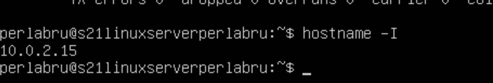
>```DHCP``` stands for ```"Dynamic Host Configuration Protocol"```. DHCP is a network-layer protocol that allows devices to automatically obtain an IP address, subnet, default gateway, and other network settings from a special server known as a DHCP server.
5. Define and display the gateway's external IP address (ip) and the gateway's internal IP address, also known as the default IP address (gw).
>Defining the external IP address of the gateway:
```c
$ curl ifconfig.me/ip
```

>Define the internal IP address of the gateway:
```c
$ ip route show default | awk '/default/ {print $3}'
```


6. Set static (manually set, not received from DHCP-server) ip, gw, dns settings (use public DNS-servers such as 1.1.1.1 or 8.8.8.8).
>To change a file, use vim
```c
$ sudo vim /etc/netplan/00-installer-config.yaml
```

>Save the changes and reboot the machine
```c
$ sudo netplan apply
$ reboot
```
>Now make sure that the settings have been changed 
```c
$ ifconfig
```
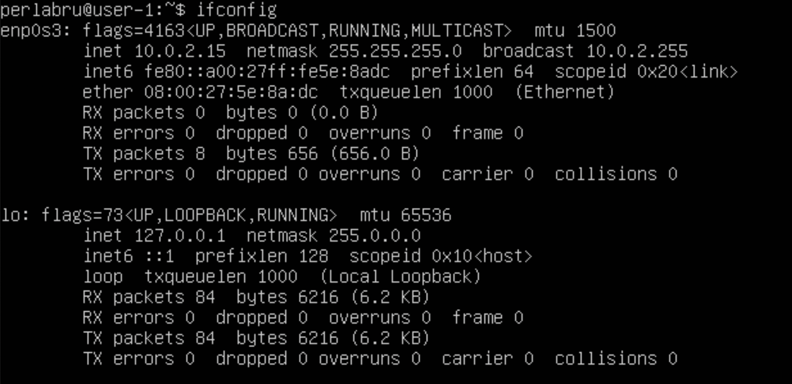
>Also check if remote hosts 1.1.1.1 and ya.ru are pinged successfully
```c
$ ping 1.1.1.1
$ ping ya.ru
```


## Part 4. Updating the OS
>To update, simply type a command into the terminal. After updating the system packages, if you enter the update command again, you should get a message that there are no updates.
```c
$ sudo apt update
$ sudo apt upgrade
```

## Part 5. Using the sudo command
>The command ```sudo``` is short for "Superuser Do". It is used in Unix operating systems and Unix-like systems such as Linux to allow normal users to execute commands with elevated privileges or as a superuser (administrator).

To allow a user to run a ```sudo``` command, you need these commands:
```c
$ sudo usermod -a -G sudo user-1
$ su user-1
$ cat /etc/hostname
$ sudo hostname perlabru-server
$ su perlabru
``` 
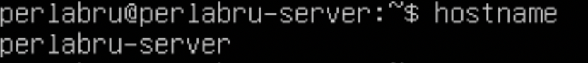

## Part 6. Installing and configuring the time service
```c
$ sudo timedatectl
$ timdatectl show
```


## Part 7. Installing and Using Text Editors
>To install the text editor VIM, NANO, JOE, you must enter the following commands:
```c
$ sudo apt update
$ sudo apt install vim
$ sudo apt install nano
$ sudo apt install joe
```
### Vim
```c
$ vim test_vim.txt
```
>Edit mode ```I```

>To exit the Edit mode ```Esc```

>To save changes ```Shift + Z + Z```

>So that the changes don't spill over ```:q!```


>To search for a word in a file, you can use the ```/word``` command, where ```"word"``` is what you are looking for. For example, to find the word ```"example"```, you can type ```/example``` after pressing Esc.


>After Vim finds the first match, you can replace that word with another using the command ```:%s/old_word/new_word/g```, where ```"old_word"``` is the word you want to replace and ```"new_word"``` is the new word you want to replace it with.


### Nano
```c
$ nano test_nano.txt
```

>To save changes ```Ctrl + O > Enter``` 

>To exit Nano ```Ctrl + X``` 

>After pressing ```Ctrl+X``` to open the Nano menu. The screen will ask "Save modified buffer? (Save modified buffer?). To ```exit without saving``` the changes, press the N key (the ```'N'``` symbol).

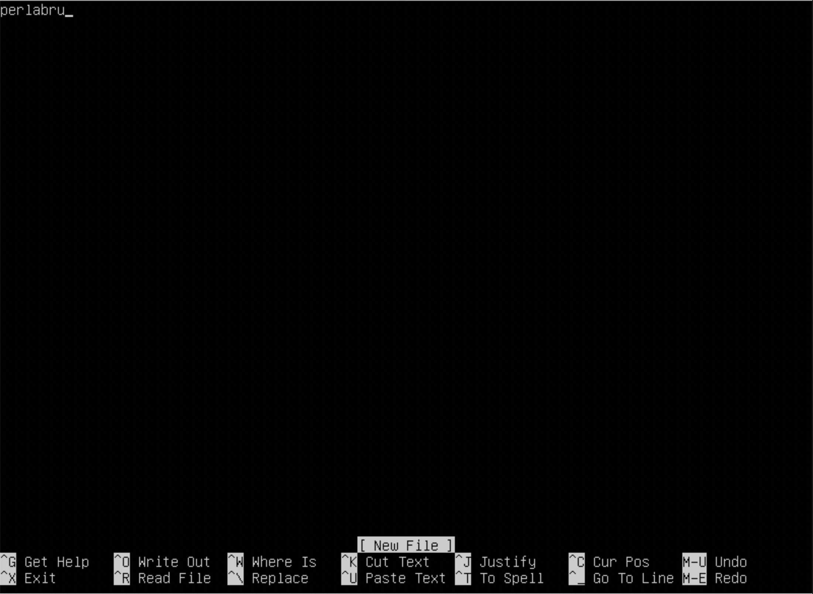

>```Ctrl + W``` to open a file content search.
Type the word or phrase you want to search for and press ```Enter```.


>To replace a found word or phrase with another, use the ```Alt + R``` or ```Option + R``` key combination, then type a new word or phrase. To replace and press ```Enter```.


### Joe
```c
$ joe test_nano.txt
```

>To exit Joe ```Ctrl + K``` after press ```X``` 

>Select "Save and exit" from the menu. To do this, move the cursor or use the appropriate keys on the keyboard to highlight this item, then press the Enter key.

>To exit text editing mode, you can also use the key combination ```Ctrl+K``` and then ```Q``` (the 'Q' symbol) to exit the editor.
If changes have been made to the file, Joe will ask: "Save modified buffer?" (```Save modified buffer?```). To exit without saving the changes, press the ```N``` key (the 'N' symbol).


>Press ```Ctrl + K```, then press the ```F``` key. This opens the search bar at the bottom of the screen.

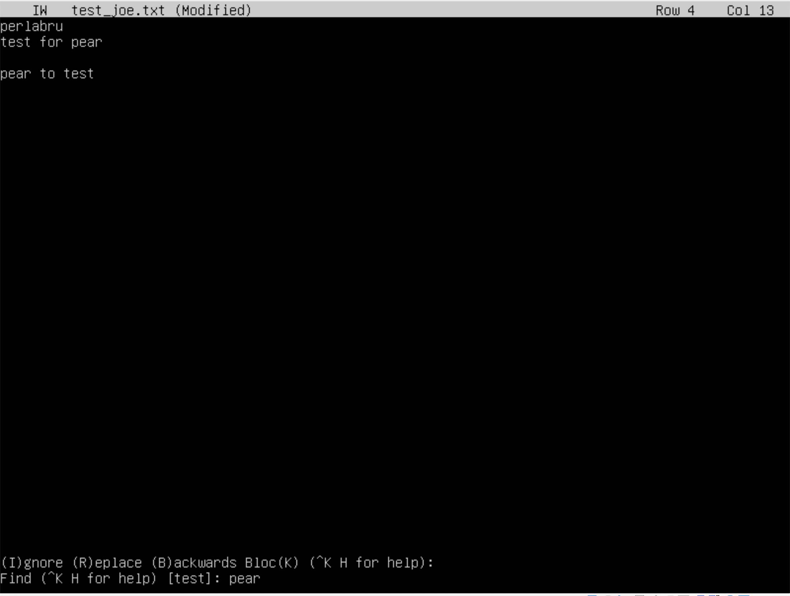

>To replace, press the ```Ctrl + K``` key, then the ```F``` key. This opens the search bar at the bottom of the screen. Enter the word you're looking for, then press Enter. Joe suggest the choice, press ```R``` to replace the word, then enter a new word. Press Enter to replace the highlighted matches found.


## Part 8. Installing and basic configuration of the SSHD service

>First you need to install the SSHd service.
```c
$ sudo apt-get install ssh
```
>To configure auto-start services at system startup. Enter:
```c
$ sudo systemctl enable ssh
$ systemctl status ssh
```
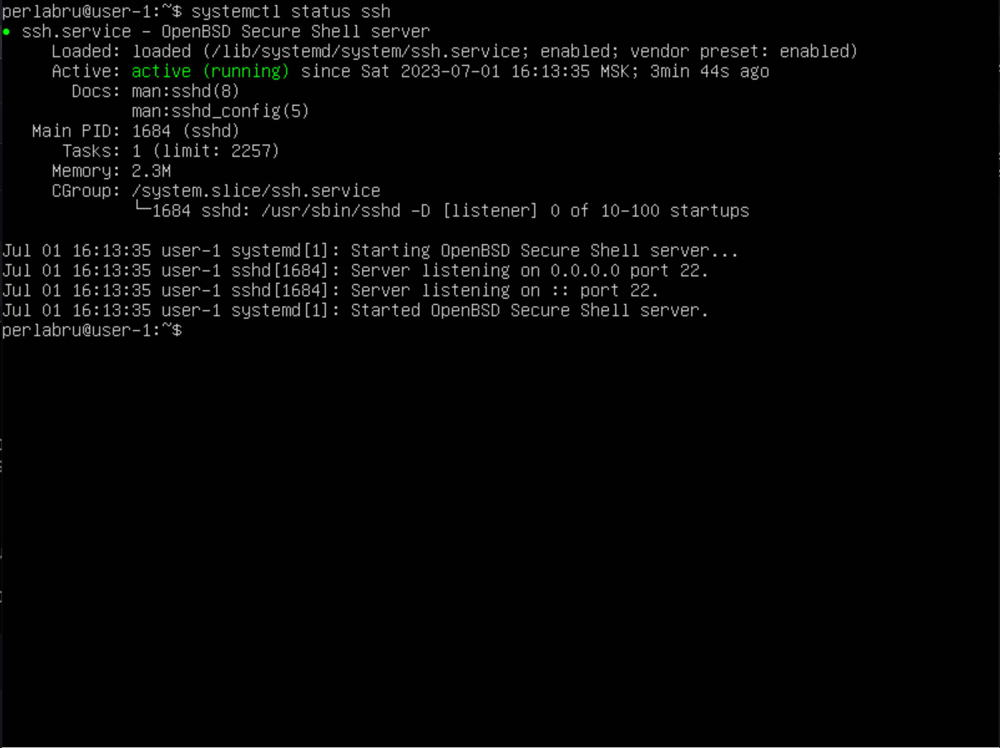

>Reconfigure the SSHd service on port 2022.

```c
$ sudo vim /etc/ssh/sshd_config
```

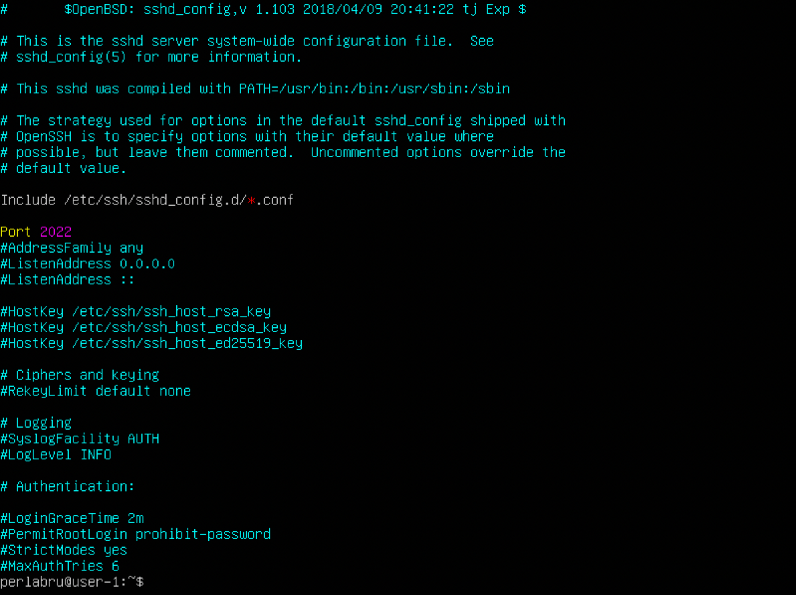

```c
$ systemctl restart sshd
```


>To show the presence of the sshd process, using the ps command.

```c
$ ps -e | grep sshd
```

- `ps` (shows the running processes executed by the user in the terminal window);
- `ps -e` or `ps -A` (To view all running processes);
- `ps -d` (To show all processes except session leaders);
- `ps -d -N` (You may invert the output with the `-N` switch. For example, if I want to display only session leaders)
- `ps T` (see only processes related to this terminal);
- `ps r` (see all running (`running`) processes);
- `ps -p 'pid'` (if you know the process PID, you can simply use the following command, to output the process with this `'pid'`);
- `ps -p 'pid1' 'pid2'`
- `ps U 'userlist'` (find all the processes executed by a particular user);
- `ps -ef` (get complete list).


>The only thing left to do is to Reboot the system.

```c
$ reboot
$ service ssh restart
$ netstat -tan 
```

- `-t (--tcp)` displays only tcp connections;
- `-a (--all)` display all active TCP connections;
- `-n (--numeric)` display active TCP connections with addresses and port numbers in numeric format;
- `Proto:` Protocol name (TCP protocol or UDP protocol);
- `recv-Q:` queue to receive the network;
- `send-Q:` Network Send Queue;
- `Local Address` address of the local computer and the port number used;
- `Foreign Address` address and number of the remote computer to which the socket is connected;
- `State` socket state;
- `0.0.0.0` means the IP address on the local machine.


## Part 9. Installing and using the utilities top, htop

### Top command output report from top:

```c
$ top
```


- `uptime` - 53 min;

- `number of authorized users` - 1;

- `total system load` - 0.00 0.00 0.00;

- `total number of processes` - 95;

- `cpu load` - 0.7%;

- `memory load` - 148M/1.93G;

- `PID of the process that is using the most memory` - 657;

- `PID of the process taking the most CPU time` - 1138.

### Screenshots of the htop command output:

```c
$ sudo apt install htop
$ htop
```


#### SORT BY PID


#### SORT BY PERCENT_CPU

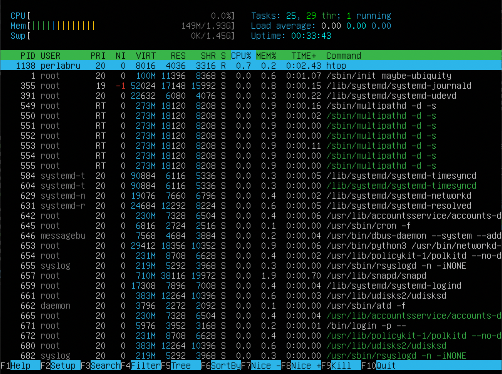

#### SORT BY PERCENT_MEM


#### SORT BY TIME

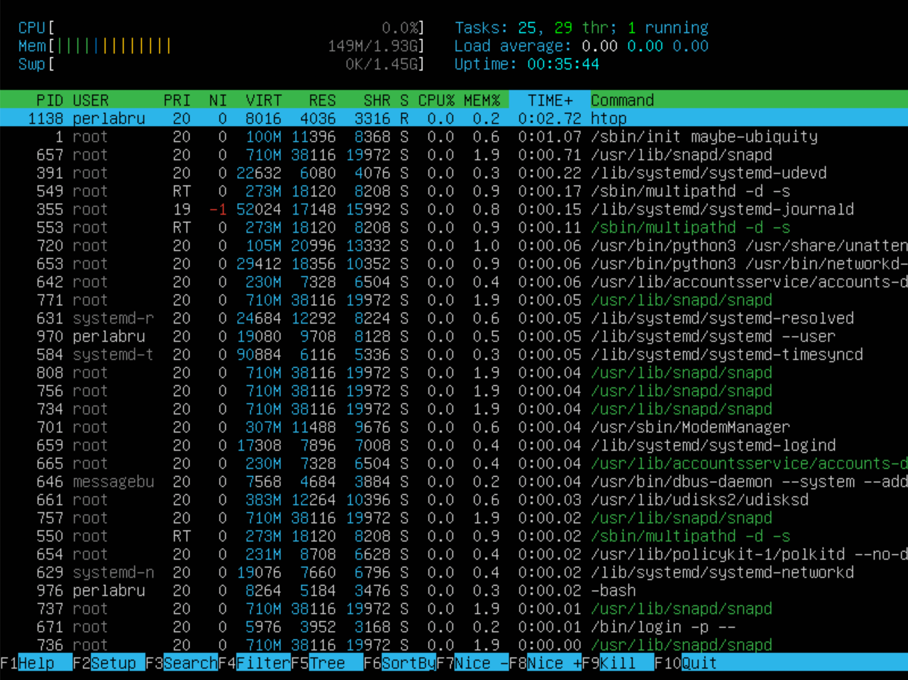

#### FILTER 'sshd'

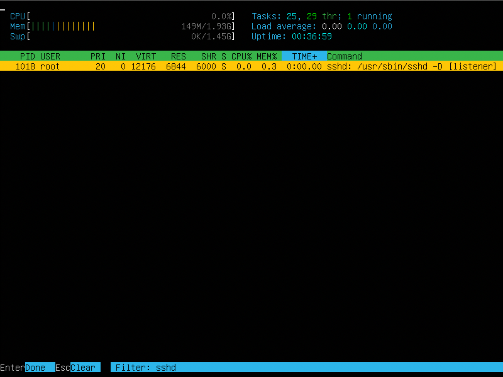

#### SEARCH 'syslog'


#### Advanced hostname, clock and uptime output


## Part 10. Using the fdisk utility

```c
$ sudo fdisk -l
$ swapon
```

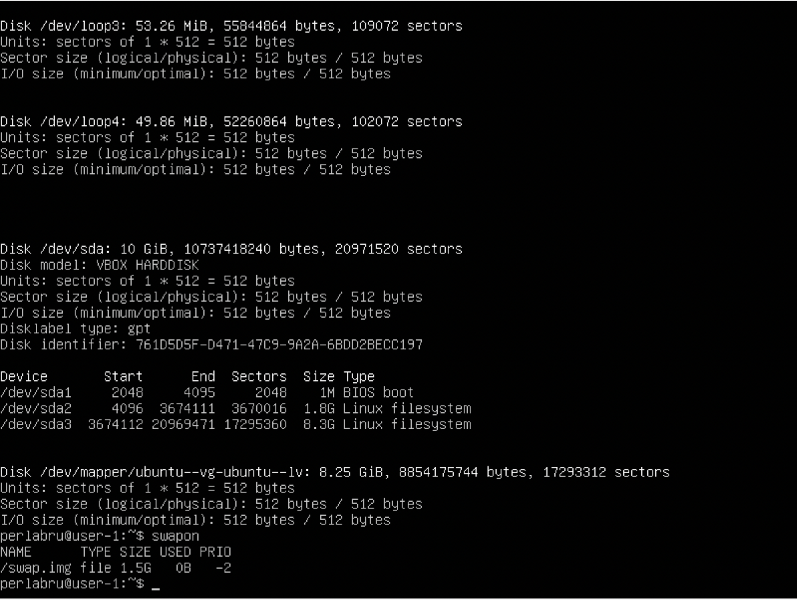

- `HDD name` - VBOX HARDDISK;
- `HDD size` - 10GiB;
- `Number of sectors` - 20971520;
- `Swap` size - 1.5G.

## Part 11. Using the df utility

```c
$ df
```


Report for the root partition (/):

- `partition size` - 8408452 Kbyte;
- `used space size` - 4214356 Kbyte;
- `free space size` - 3745380 Kbyte;
- `percentage of usage` - 53%.

```c
$ df -Th
```


Report for the root partition (/):

- `partition size` - 8.1 G;
- `used space size` - 4.1 G;
- `free space size` - 3.6 G;
- `percentage of usage` - 53%;
- `file system type for the partition` - ext4.

## Part 12. Using the du utility

```c
$ sudo du -sh /var/log /var /home 
$ sudo du -s --block-size=1 /var/log /var /home  
```

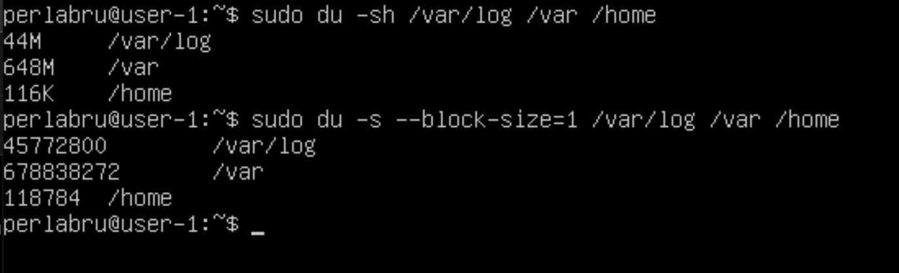

```c
$ sudo du -sh /var/log/* 
```

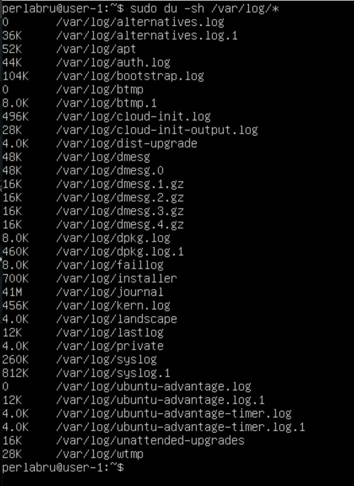

## Part 13. Installing and Using the ncdu Utility

```c
$ sudo apt install ncdu
```
```c
$ ncdu /home/
```


```c
$ ncdu /var/
```


```c
$ ncdu /var/log/
```
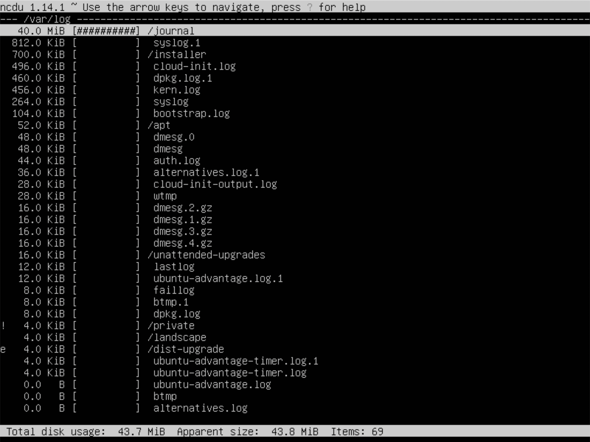

## Part 14. Working with system logs

```c
$ sudo vim /var/log/dmesg
$ sudo vim /var/log/syslog
$ sudo vim /var/log/auth.log
```


- Last successful authorization: Jul 1 20:49:53;
- Username: perlabru;
- Login method: pam-unix.

```c
$ sudo systemctl restart ssh
$ cat /var/log/syslog
```

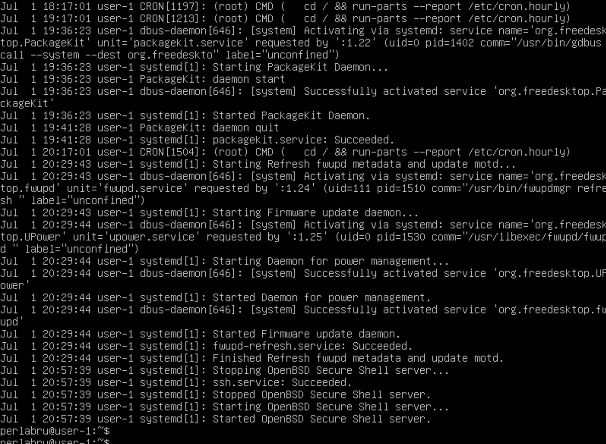

## Part 15. Using the CRON Job Scheduler

To through the job scheduler, run the uptime command every 2 minutes. You need to open the scheduler and add a task (*/2 * * * * uptime).

```c
% sudo crontab -e
```


```c
% sudo crontab -l
```

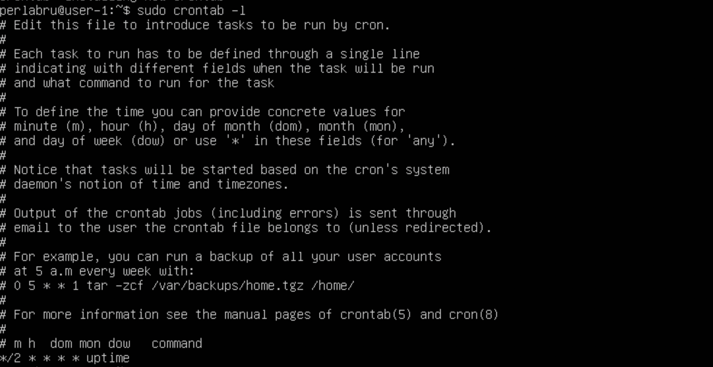

>Task logs from the scheduler:


>Deleting all tasks from the scheduler:

```c
$ sudo crtontab -r
$ sudo crtontab -l
```

