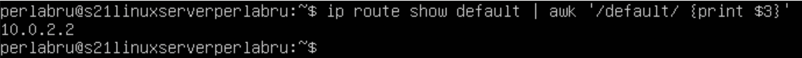
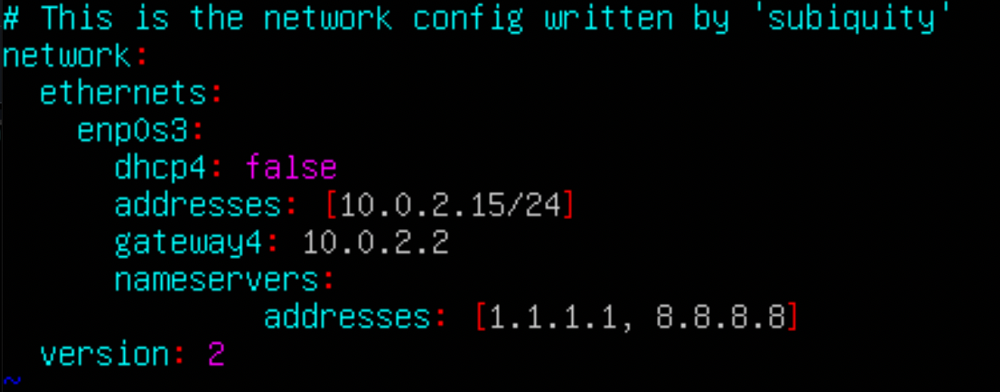
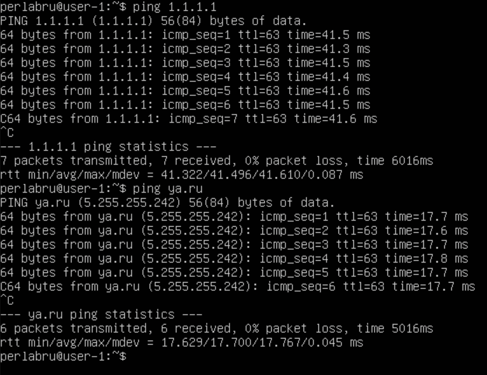
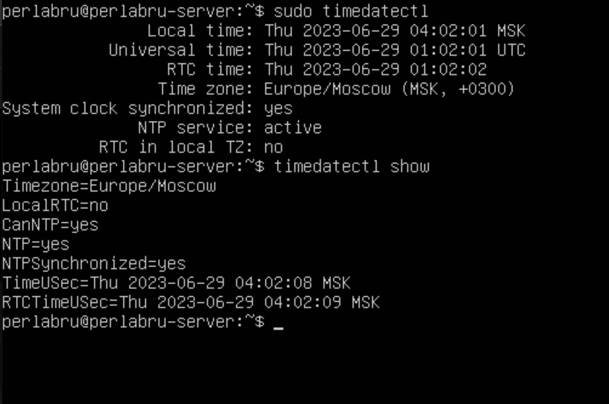

# UNIX/Linux/DevOps

Installing and upgrading a Linux system. Administration basics.

## Contents

1. [Part 1. Installing the OS](#part-1)

2. [Part 2. Creating a new user](#part-2)

3. [Part 3. Setting up the OS network](#part-3)

4. [Part 4. Updating the OS](#part-4)

5. [Part 5. Using the sudo command](#part-5)

6. [Part 6. Installing and configuring the time service](#part-6)

## [Part 1. Installing the OS](#part-1)

You can check the installed version of Ubuntu by running the command:

```c
$ cat /etc/issue
```


## [Part 2. Creating a new user](#part-2)

To create a new user and add him to the adm group, follow these steps:

```c
$ sudo adduser <user_name>
$ sudo usermod -aG adm <user_name>
$ cat /etc/passwd | grep <user_name>
```


You can also check the list of user groups by using the command:

```c
$ groups <user_name>
```


## [Part 3. Setting up the OS network](#part-3)

1. Set the new machine name as user-1. To do this, you can use the command:

```c
$ hostnamectl set-hostname <host_name>
```
>To show system information, including the current hostname, you can use the command:
```c
$ hostnamectl
```
>Or:
```c
$ hostname
```


2. Set the time zone corresponding to your current location.
```c
$ sudo timedatectl
$ sudo timedatectl set-timezone Europe/Moscow
$ sudo timedatectl
```

3. Output the names of the network interfaces with the console command. To do this, you must install a set of networking tools:
```c
$ sudo apt install net-tools
```
>A new command can be used to output the names of the network interfaces:
```c
$ ifconfig -a
```

>The ```lo (Local Loopback)``` interface is a special virtual connection on your computer that allows it to send and receive data without connecting to the Internet or other devices. You can use it to test and verify network applications on your own computer just as if they were running on a remote server. It is already configured and available in Linux by default and you don't need to configure anything else.

4. To get the IP address of the device you are working with from the DHCP server. Use this command:
```c
$ hostname -I
```

>```DHCP``` stands for ```"Dynamic Host Configuration Protocol"```. DHCP is a network-layer protocol that allows devices to automatically obtain an IP address, subnet, default gateway, and other network settings from a special server known as a DHCP server.
5. Define and display the gateway's external IP address (ip) and the gateway's internal IP address, also known as the default IP address (gw).
>Defining the external IP address of the gateway:
```c
$ curl ifconfig.me/ip
```

>Define the internal IP address of the gateway:
```c
$ ip route show default | awk '/default/ {print $3}'
```


6. Set static (manually set, not received from DHCP-server) ip, gw, dns settings (use public DNS-servers such as 1.1.1.1 or 8.8.8.8).
>To change a file, use vim
```c
$ sudo vim /etc/netplan/00-installer-config.yaml
```

>Save the changes and reboot the machine
```c
$ sudo netplan apply
$ reboot
```
>Now make sure that the settings have been changed 
```c
$ ifconfig
```

>Also check if remote hosts 1.1.1.1 and ya.ru are pinged successfully
```c
$ ping 1.1.1.1
$ ping ya.ru
```


## [Part 4. Updating the OS](#part-4)
>To update, simply type a command into the terminal. After updating the system packages, if you enter the update command again, you should get a message that there are no updates.
```c
$ sudo apt update
$ sudo apt upgrade
```

## [Part 5. Using the sudo command](#part-5)
>The command ```sudo``` is short for "Superuser Do". It is used in Unix operating systems and Unix-like systems such as Linux to allow normal users to execute commands with elevated privileges or as a superuser (administrator).

To allow a user to run a ```sudo``` command, you need these commands:
```c
$ sudo usermod -a -G sudo user-1
$ su user-1
$ cat /etc/hostname
$ sudo hostname deltajed-server-2
$ su deltajed
``` 


## [Part 6. Installing and configuring the time service](#part-6)
```c
$ sudo timedatectl
$ timdatectl show
```
